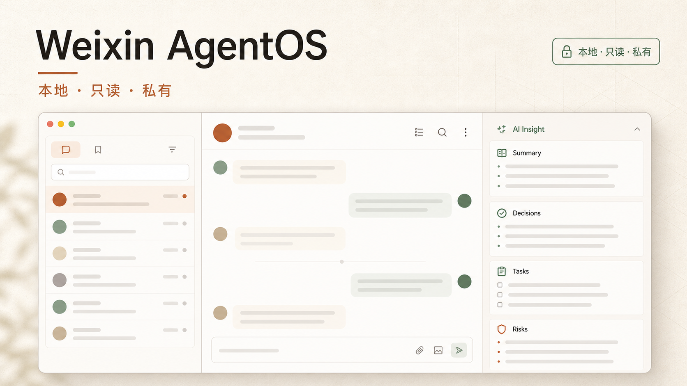

# Weixin AgentOS

[](https://github.com/fankaibo/AIWeChat/actions/workflows/ci.yml)

Weixin AgentOS 是一个面向个人 Mac 的本地微信只读工作台。它从用户自行准备的微信本地只读快照中读取会话、联系人和媒体，通过网页提供浏览、搜索、统计以及带原文引用的 LLM 对话。

> 本项目不是微信官方客户端，不提供消息发送、自动回复、已读状态写入或联系人修改能力。



## 核心能力

- 微信式会话、公众号、联系人和消息浏览界面。
- 当前会话自动加载新消息，不会因其他会话更新而切换阅读位置。
- 游标分页读取完整历史消息，支持搜索、媒体筛选和本地统计。
- 图片原图预览、视频/封面解析、语音本机 Whisper 转写。
- 引用/回复消息还原，链接、文件、系统消息和合并记录摘要展示。
- 本地规则总结、待办/风险提取、月度聊天热力图。
- 多模型 LLM 工作区、显式消息引用、可回跳的 `[M#]` 引用和本机历史。
- 一键隐私首页，隐藏会话列表和聊天正文。

## 安全边界

- 微信原始目录只作为不可变输入。
- SQLite 使用只读模式，并执行 `PRAGMA query_only=ON`。
- 本地 API 固定监听 `127.0.0.1`。
- 不发送微信消息，不写已读状态，不修改联系人，不自动操作微信窗口。
- LLM 仅在用户主动提问时接收选中的上下文；Responses API 请求使用 `store: false`。
- `.env`、数据库、密钥、日志、LLM 历史、转写缓存和媒体全部被 Git 忽略。

完整约束见 [SECURITY.md](SECURITY.md)。

## 架构

```text
App Store WeChat 加密 DB/WAL
              │ 只读监测
              ▼
local/live-sync.mjs
  ├─ 捕获稳定的数据库/WAL 副本
  ├─ 增量生成版本化只读快照
  ├─ PRAGMA quick_check 校验
  └─ 原子切换 .local/wechat-live/current
              │
              ▼
local/server.mjs · 127.0.0.1:8787
  ├─ SQLite query_only 数据访问
  ├─ 图片、视频和语音按需解析
  ├─ 本地规则分析
  └─ LLM 代理与本机历史
              │
              ▼
Vinext + React · localhost:3000
```

网页不会直接打开微信正在写入的数据库。实时模式先生成并验证新快照，再原子发布；失败时继续使用上一版快照。

## 环境要求

- macOS（真实微信数据模式需要 App Store 版微信）。
- Node.js `>= 22.13.0`，推荐使用仓库 `.nvmrc` 指定的版本。
- npm `>= 10`。
- 可选：OpenAI Whisper、Python 和 `ffmpeg`，用于本机语音转写。
- 可选：兼容的 SILK 解码模块，用于微信 SILK 语音。

## 快速开始

以下步骤不需要微信数据库或 LLM Key，会以安全演示数据启动：

```bash
git clone https://github.com/fankaibo/AIWeChat.git
cd AIWeChat

nvm use            # 可选；读取 .nvmrc
npm ci
npm run local
```

打开：

- 网页：`http://localhost:3000`
- 本地 API：`http://127.0.0.1:8787`
- 健康检查：`http://127.0.0.1:8787/api/health`

`npm run local` 会同时启动网页、本地 API 和只读同步器。未配置有效快照时，API 自动使用演示数据。

## 配置真实只读数据

仓库不包含微信数据、数据库密钥、账号路径或聊天导出。只应处理你本人拥有且有权读取的数据。

复制配置模板：

```bash
cp .env.example .env
chmod 600 .env
```

### 静态快照

已有解密后的只读快照时，只需配置：

```dotenv
WEIXIN_DECRYPTED_DIR=/absolute/path/to/decrypted-snapshot
```

快照至少应包含：

```text
contact/contact.db
session/session.db
message/message_*.db
```

### 实时只读快照

实时模式需要用户自行准备原始数据库目录和本机数据库密钥文件：

```dotenv
WEIXIN_LIVE_SOURCE=/absolute/path/to/wechat/db_storage
WEIXIN_LIVE_ROOT=/absolute/path/to/project/.local/wechat-live
WEIXIN_LIVE_KEYS=/absolute/path/to/project/.local/wechat-live/keys.json
WEIXIN_LIVE_STATUS=/absolute/path/to/project/.local/wechat-live/status.json
WEIXIN_DECRYPTED_DIR=/absolute/path/to/project/.local/wechat-live/current
```

密钥和运行目录必须限制为当前用户访问：

```bash
chmod 700 .local .local/wechat-live
chmod 600 .local/wechat-live/keys.json
```

标准启动流程不会扫描微信进程内存、修改微信签名或自动获取密钥。`local/live/` 中的诊断辅助代码不属于常规运行链路，只能在用户明确授权的本机诊断场景中评估。

## LLM 配置

最简单的 Responses API 配置：

```dotenv
OPENAI_API_KEY=your_key_here
WEIXIN_LLM_MODEL=your_model_id
WEIXIN_LLM_REASONING=medium
WEIXIN_LLM_CONTEXT_LIMIT=120
```

也可以显式指定本机凭据文件：

```dotenv
WEIXIN_LLM_KEY_FILE=/absolute/path/to/credential-file
```

将其设为 `disabled` 可以停用凭据文件加载：

```dotenv
WEIXIN_LLM_KEY_FILE=disabled
```

凭据只由本地 API 读取。浏览器只接收模型名称、可用状态等非秘密元数据。

## 本机语音转写

```dotenv
WEIXIN_WHISPER_PATH=/absolute/path/to/whisper
WEIXIN_WHISPER_PYTHON=/absolute/path/to/python
WEIXIN_WHISPER_MODEL=base
WEIXIN_WHISPER_LANGUAGE=zh
```

语音仅在用户点击“转为文字”后处理，不会批量转写或上传。结果保存在被忽略的 `.local/voice-transcripts/` 中。

## 构建与验证

安装锁定依赖并执行完整检查：

```bash
npm ci
npm run check
```

单独执行：

```bash
npm run typecheck  # TypeScript
npm run lint       # ESLint
npm run privacy:check # 本地数据、绝对路径与常见密钥检查
npm test           # 构建并运行全部 Node 测试
npm run build      # 生产构建到 dist/
npm run start      # 启动已构建的网页服务
```

生产构建只包含网页。需要真实数据时，本地 API 和同步器仍应在另外两个终端运行：

```bash
npm run sync
npm run api
npm run start
```

测试使用临时数据库和模拟上游，不需要真实微信数据或 LLM Key。

## macOS 后台常驻

仓库只提交无个人路径的模板：

```text
local/launchd/com.example.weixin-agentos.plist.example
```

复制模板后，将 `__NODE_BINARY__` 和 `__PROJECT_DIRECTORY__` 替换为本机绝对路径，并按需修改 label。不要提交生成后的 `.plist`。

安装前先校验：

```bash
plutil -lint /path/to/generated.plist
```

然后将其复制到 `~/Library/LaunchAgents/` 并使用对应 label 加载。后端代码变更后，需要重启该 launchd 服务才能生效。

## 常用脚本

| 命令 | 作用 |
| --- | --- |
| `npm run local` | 同时启动同步器、本地 API 和网页开发服务 |
| `npm run dev` | 只启动网页开发服务 |
| `npm run api` | 只启动 `127.0.0.1:8787` API |
| `npm run sync` | 只启动实时只读同步器 |
| `npm run build` | 创建生产构建 |
| `npm run start` | 启动生产网页构建 |
| `npm run typecheck` | 运行 TypeScript 检查 |
| `npm run lint` | 运行 ESLint |
| `npm run privacy:check` | 检查本地数据、机器路径和常见密钥 |
| `npm test` | 构建并运行测试 |
| `npm run check` | 类型检查、Lint、构建和全部测试 |

## 项目结构

```text
app/                     React 页面、样式和客户端状态
local/                   本地只读 API、同步、解析和 LLM
  launchd/               无个人信息的后台服务模板
tests/                   临时数据库和模拟上游回归测试
worker/                  Vinext/Cloudflare 构建入口
db/ drizzle/ examples/   可选 Sites/D1 脚手架
build/                   Sites 构建插件源码
public/                  静态资源和无真实数据的产品示意图
.github/                 CI 和 Pull Request 模板
.openai/                 Sites 构建元数据；不代表允许公网部署
```

更详细的工程交接约束见 [CLAUDE.md](CLAUDE.md)。参与开发前请阅读 [CONTRIBUTING.md](CONTRIBUTING.md)。

## 隐私检查

提交前至少确认：

```bash
git status --short
git diff --cached --name-only
npm run check
```

以下内容永远不应进入 Git：

- `.env`、API Key 和凭据文件
- `.local/`、数据库密钥和解密快照
- 微信数据库、WAL、聊天导出和媒体
- LLM 历史、语音转写缓存和运行日志
- 含本机用户名或绝对路径的 launchd 配置

## 已知限制

- 未读数来自微信本地会话表；本网页不能写已读状态。
- LLM 当前为非流式请求，尚无中途取消。
- 搜索和部分分析使用有上限的消息窗口，不等同于完整语义索引。
- 已被微信清理或从未下载的历史媒体无法恢复。
- 微信数据库结构或媒体格式升级后可能需要只读兼容更新。

## License

本仓库当前未声明开源许可。除非仓库所有者另行授权，保留所有权利。
